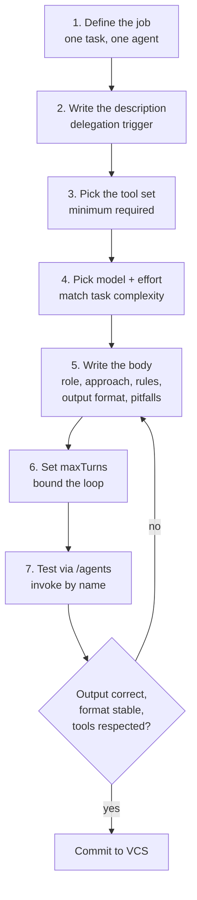

# Agents — How-To Guide

> **Source of truth**: `agents/<agent-name>.md`
> **Reference**: [Claude Code Subagents](https://code.claude.com/docs/en/sub-agents)

An agent is a single Markdown file with YAML frontmatter that defines a specialized AI worker. It runs in its **own isolated context window**: it sees only its system prompt plus the delegated task, and returns only its final answer to the parent conversation. This guide covers how to build effective agent files, step by step.

---

## File format

Every agent is one `.md` file with two parts:

1. **YAML frontmatter** — configuration: identity, delegation trigger, tools, model, limits
2. **Markdown body** — the system prompt: who the agent is, how it works, what it returns

```markdown
---
name: security-reviewer
description: Reviews code for security vulnerabilities. Use after any change to auth, data handling, or API endpoints.
tools: Read, Grep, Glob
model: sonnet
maxTurns: 20
---

You are a senior security engineer. Review the provided code for vulnerabilities.

## Approach
1. Identify recently changed files
2. Analyze for OWASP Top 10 vulnerabilities
3. Check for secrets, SQL injection, and hardcoded credentials

## Output format
- **Critical**: must fix before merge
- **Warning**: should fix soon
- **Info**: suggestions
```

Key mechanics to design around:

- The body becomes the agent's **entire system prompt**. The agent does *not* receive the default Claude Code system prompt — only the body plus basic environment details, the delegation message, `CLAUDE.md` hierarchy, and a git status snapshot.
- Agent files are loaded **at session start**. After editing a file on disk, restart the session (agents created via `/agents` apply immediately).
- The agent starts in the parent's working directory; `cd` does **not** persist between Bash calls.
- Agents **cannot spawn other agents**.

### Where to put agent files

| Scope | Path | Use case |
|-------|------|----------|
| Project | `.claude/agents/` | Team-shared; commit to VCS |
| User | `~/.claude/agents/` | Personal agents across all projects |
| Plugin | `plugins/<name>/agents/` | Distributed with a plugin |

On a name collision: managed settings > CLI `--agents` > project > user > plugin. Both project and user directories are scanned recursively; subfolders are organizational only — identity comes from the `name` field. In a **plugin**, the subfolder becomes part of the scoped identifier: `agents/review/security.md` in `my-plugin` registers as `my-plugin:review:security`.

---

## The build process



Each step is covered in detail below.

---

## Step 1 — Define the job

One agent = one task. Before writing anything, answer in one sentence: *"This agent takes X and returns Y."* If the sentence needs "and", split the agent.

| Good scope | Bad scope |
|------------|-----------|
| "Takes a diff, returns security findings with severity" | "Helps with code quality and testing and docs" |
| "Takes a failing test run, returns root cause + fix" | "General-purpose coding assistant" |
| "Takes an OpenAPI spec, returns generated TS types" | "Does whatever is asked" |

---

## Step 2 — Write the description

The `description` field is what Claude reads to decide **whether and when to invoke this agent**. It is the single highest-leverage line in the file: a bad description means the agent never runs, or runs at the wrong time.

### Formula

```
[What the agent does]. Use [when / for trigger conditions].
```

### Good descriptions

```yaml
description: Reviews pull request diffs for security vulnerabilities. Use after any change to authentication, authorization, data handling, or API endpoints.
```

```yaml
description: Analyzes database query performance using EXPLAIN plans. Use when queries are slow, when adding indexes, or when changing ORM configurations.
```

```yaml
description: Runs test suites and analyzes coverage reports. Use for test execution, coverage analysis, or when tests fail in CI.
```

### Bad descriptions

```yaml
# Too vague — Claude cannot tell when to use it
description: Helps with code quality.

# Too generic — overlaps with everything
description: A general-purpose coding assistant.

# Marketing language — tells Claude nothing actionable
description: World-class security auditing powered by AI.
```

### Techniques

- **Trigger keywords**: include the nouns and verbs a user would actually type ("test coverage", "EXPLAIN plan", "swagger.json"). Delegation matches your description against the user's request.
- **Proactive phrasing**: `Use proactively after writing or modifying code.` — the official docs explicitly recommend "use proactively" to encourage automatic delegation.
- **Boundaries**: if two agents could overlap, state the boundary in both descriptions ("...for unit tests; for E2E tests use e2e-runner").

---

## Step 3 — Pick the tool set

Tools are the **primary safety mechanism**. Give the agent exactly what the job needs — nothing more. If `tools` is omitted, the agent inherits **all** tools from the main conversation, including MCP tools.

### Common tool sets

| Agent type | Tools | Rationale |
|------------|-------|-----------|
| Read-only reviewer / auditor | `Read, Grep, Glob` | Can inspect, never modify |
| Research / analysis | `Read, Grep, Glob, WebFetch, WebSearch` | Explore code and docs, no writes |
| Code writer / fixer | `Read, Write, Edit, Bash, Glob, Grep` | Full development capability |
| Test runner | `Read, Bash, Grep, Glob` | Execute and read results, no edits |
| Documentation writer | `Read, Write, Edit, Glob, Grep` | Read code, write docs, no shell |

### Allowlist vs denylist

```yaml
# Option A: allowlist (recommended for restricted agents)
# The agent gets ONLY these tools — no Write/Edit, no MCP tools
tools: Read, Grep, Glob

# Option B: denylist
# The agent inherits everything (including MCP tools) EXCEPT these
disallowedTools: Write, Edit
```

If both are set, `disallowedTools` is applied first, then `tools` is resolved against the remainder; a tool listed in both is removed. **Prefer the allowlist** — it fails closed.

### Finer control: validate tool calls with a hook

When the `tools` field is too coarse ("Bash yes, but read-only SQL only"), add a `PreToolUse` hook. The script receives the tool input as JSON on stdin; **exit code 2 blocks the call** and feeds stderr back to the agent:

```yaml
---
name: db-reader
description: Execute read-only database queries. Use when analyzing data or generating reports.
tools: Bash
hooks:
  PreToolUse:
    - matcher: "Bash"
      hooks:
        - type: command
          command: "./scripts/validate-readonly-query.sh"
---
```

```bash
#!/bin/bash
# Block SQL write operations, allow SELECT queries
INPUT=$(cat)
COMMAND=$(echo "$INPUT" | jq -r '.tool_input.command // empty')
if echo "$COMMAND" | grep -iE '\b(INSERT|UPDATE|DELETE|DROP|CREATE|ALTER|TRUNCATE)\b' > /dev/null; then
  echo "Blocked: Only SELECT queries are allowed" >&2
  exit 2  # Exit code 2 blocks the tool call
fi
exit 0
```

> **Plugin restriction**: `hooks`, `mcpServers`, and `permissionMode` are **ignored** in plugin-shipped agents (security). If the agent needs them, the user must copy the file into `.claude/agents/` or `~/.claude/agents/`.

---

## Step 4 — Pick model and effort

| Model | Cost | Speed | Best for |
|-------|------|-------|----------|
| `haiku` | Low | Fast | Search, exploration, doc generation, simple lookups |
| `sonnet` | Medium | Balanced | Most coding tasks, debugging, refactoring, reviews |
| `opus` | High | Slow | Architecture decisions, security audits, deep reasoning |
| `inherit` | — | — | Use the parent conversation's model (the default) |

Decision framework:

```
Purely lookup / exploration?            → haiku
Standard coding, debugging, review?     → sonnet
Deep reasoning, security, architecture? → opus
Should adapt to the session?            → inherit
```

Notes:

- `model` accepts an alias (`sonnet`, `opus`, `haiku`, `fable`), a full model ID (e.g. `claude-opus-4-8`), or `inherit`. Default: `inherit`.
- Resolution order at invocation: `CLAUDE_CODE_SUBAGENT_MODEL` env var → per-invocation `model` parameter → frontmatter `model` → parent's model.
- `effort` (`low`, `medium`, `high`, `xhigh`, `max`; available levels depend on the model) overrides the session effort level — pair `haiku` + `low` for cheap scan agents, `opus` + `high` for audit agents.

**Cost tip**: a reviewer on `haiku` reading 50 files costs a fraction of `opus`, and for style/naming/basic-pattern reviews the quality difference is negligible. Reserve `opus` for agents that genuinely need deep analysis.

---

## Step 5 — Write the system prompt body

The body is the agent's **entire world**. It sees this plus the delegated task — nothing from the parent conversation. Write it self-contained.

### Structure template

```markdown
---
name: my-agent
description: ...
tools: ...
model: ...
---

You are a [specific role]. Your job is to [one task].

## Context
[What the agent must know about the domain/project — only project-specific facts]

## Approach
1. [First action — how to orient in a fresh context]
2. [Step-by-step process]

## Rules
- [Hard constraint]
- [Hard constraint]

## Output format
[Exact structure the agent must return]

## Pitfalls
- [Known gotcha in this domain]
```

### What to include

| Section | Why | Example |
|---------|-----|---------|
| **Role, one sentence** | Anchors expertise and tone | "You are a senior backend engineer specializing in Go microservices." |
| **"When invoked" steps** | The agent starts with zero context; tell it how to orient | "1. Run git diff. 2. Focus on modified files. 3. Begin review immediately." |
| **Hard rules** | Non-negotiable constraints | "Never modify files outside src/." |
| **Output format** | The parent sees *only* the final answer — its shape is the agent's entire value | "Return findings as: severity, file:line, issue, fix." |
| **Pitfalls** | Prevents known failure modes | "Do not flag TypeScript `any` in test files — it is intentional there." |
| **One output example** | Shows the desired shape better than prose | "`{severity: 'critical', file: 'auth.ts', line: 42, ...}`" |

### What NOT to include

| Anti-pattern | Why | Fix |
|--------------|-----|-----|
| Vague role ("helpful assistant") | Nothing to anchor on | "You are a PostgreSQL query optimizer." |
| Long prose paragraphs | Structured instructions are followed more reliably | Numbered lists, bullets, tables |
| References to the parent conversation | The agent cannot see it | Make the prompt self-contained |
| Tool micro-instructions ("Use Bash to...") | The agent already knows its tools | Describe *what* to do, not *how* to call tools |
| Marketing fluff ("world-class") | Wastes tokens, changes nothing | Concrete, observable instructions |
| Knowledge dumps (20 paragraphs of OWASP) | The model knows OWASP; the dump bloats context | Move reference material to a skill and preload it via `skills:` |

### Preloading knowledge instead of dumping it

```yaml
# Full skill content is injected at agent startup — not just the description
skills:
  - rest-api-conventions
  - error-handling-patterns
```

The agent can still discover unlisted skills via the Skill tool; to forbid that, add `Skill` to `disallowedTools`. Skills with `disable-model-invocation: true` cannot be preloaded.

### Persistent memory (optional)

`memory: project | user | local` gives the agent a directory that survives across conversations; the first 200 lines / 25 KB of its `MEMORY.md` are injected into its prompt, and Read/Write/Edit are auto-enabled for it. `project` (`.claude/agent-memory/<name>/`) is the recommended default — shareable via VCS. Pair it with a body instruction:

```markdown
Update your agent memory as you discover codepaths, patterns, and key
architectural decisions. Write concise notes about what you found and where.
```

---

## Step 6 — Set maxTurns

`maxTurns` caps the agentic loop. Without it, a stuck agent can grind until context exhaustion. Heuristic values (not an official spec — tune per agent):

| Task type | Recommended `maxTurns` |
|-----------|------------------------|
| Single-file review / simple lookup | 5–10 |
| Multi-file review or analysis | 15–25 |
| Implementation / refactoring | 20–40 |
| Complex multi-step investigation | 30–60 |

Rule of thumb: ~2× the number of steps in the agent's "Approach" section — room for error recovery without infinite loops.

---

## Frontmatter reference

Only `name` and `description` are required.

| Field | Required | Description |
|-------|----------|-------------|
| `name` | **Yes** | Unique identifier (lowercase, hyphens). Hooks receive it as `agent_type`; filename does not have to match |
| `description` | **Yes** | When Claude should delegate — the routing signal |
| `tools` | No | Allowlist. Inherits **all** tools (incl. MCP) if omitted |
| `disallowedTools` | No | Denylist, applied before `tools` is resolved |
| `model` | No | `sonnet`, `opus`, `haiku`, `fable`, full model ID, or `inherit` (default) |
| `effort` | No | `low`, `medium`, `high`, `xhigh`, `max` (model-dependent) |
| `maxTurns` | No | Max agentic turns before the agent stops |
| `skills` | No | Skills whose **full content** is injected at startup |
| `memory` | No | `user`, `project`, or `local` — persistent cross-session memory |
| `background` | No | `true` = always run as a non-blocking background task |
| `isolation` | No | `worktree` — run in a temporary git worktree (isolated repo copy) |
| `permissionMode` | No | `default`, `acceptEdits`, `auto`, `dontAsk`, `bypassPermissions`, `plan`. Ignored in plugin agents |
| `mcpServers` | No | MCP servers for this agent (name reference or inline definition). Ignored in plugin agents |
| `hooks` | No | Lifecycle hooks scoped to this agent. Ignored in plugin agents |
| `color` | No | UI color: `red`, `blue`, `green`, `yellow`, `purple`, `orange`, `pink`, `cyan` |
| `initialPrompt` | No | Auto-submitted first user turn when the agent runs as the main session (`claude --agent <name>`) |

---

## Complete examples

### Example 1 — Code reviewer (read-only, focused)

```markdown
---
name: code-reviewer
description: Reviews code for quality, security, and best practices. Use proactively after writing or modifying code.
tools: Read, Grep, Glob, Bash
model: sonnet
maxTurns: 25
---

You are a senior code reviewer ensuring high standards of quality and security.

## When invoked
1. Run git diff to see recent changes
2. Focus on modified files
3. Begin review immediately

## Review checklist
- Logic correctness and edge cases
- Error handling completeness
- No exposed secrets or API keys
- Input validation
- Naming and readability

## Rules
- Never modify any files — this is a read-only review
- Actionable feedback only, no style nitpicks
- Always give file path and line number for each finding
- If the code is good, say so explicitly — silence is not a review

## Output format
For each finding:
- **Severity**: critical | warning | info
- **File**: path/to/file.ts:42
- **Issue**: one-line description
- **Fix**: concrete suggestion or snippet

End with: total findings by severity, overall verdict (approve / request changes).
```

### Example 2 — Test runner (cheap, bounded)

```markdown
---
name: test-runner
description: Runs test suites and analyzes results. Use for test execution, coverage analysis, or diagnosing test failures.
tools: Read, Bash, Grep, Glob
model: haiku
maxTurns: 15
---

You are a test execution specialist.

## Process
1. Detect the test framework (package.json scripts, pytest.ini, jest.config, etc.)
2. Run the relevant suite
3. Analyze: passed / failed / skipped counts; for failures extract test name,
   error message, stack trace, and read the relevant source to find root cause
4. If a coverage command exists, run it and summarize key metrics

## Rules
- Run tests from the project root unless told otherwise
- Never modify test files
- Report the exact commands used so results are reproducible

## Output format
- Framework and exact command
- Totals: passed / failed / skipped
- Per failure: name, error, file:line, root-cause analysis
- Coverage summary if available
```

### Example 3 — Implementer in an isolated worktree

```markdown
---
name: feature-implementer
description: Implements a scoped feature or fix end to end. Use for self-contained implementation tasks with clear acceptance criteria.
tools: Read, Write, Edit, Bash, Glob, Grep
model: inherit
maxTurns: 40
isolation: worktree
skills:
  - project-conventions
---

You are a senior engineer implementing one scoped change.

## Process
1. Read the task and acceptance criteria
2. Locate the relevant modules with Glob/Grep before writing anything
3. Implement the minimal change that satisfies the criteria
4. Run the test suite; fix regressions you introduced
5. Summarize: files changed, approach taken, test results

## Rules
- Follow the conventions from the preloaded skill
- No drive-by refactors outside the task scope
- Every new public function gets a test

## Output format
- Files changed (paths)
- One-paragraph approach summary
- Test command + result
```

---

## Anti-patterns

### 1. The kitchen-sink agent

```markdown
❌ name: super-agent
   description: Reviews code, writes tests, deploys, manages databases.
   body: "You are an expert at everything. Do whatever is asked."
```

No focus → Claude cannot decide when to invoke it, and the prompt gives no framework. **Fix**: split into single-responsibility agents.

### 2. The vague reviewer

```markdown
❌ description: Reviews things.
   body: "Review the code and tell me if it's good."
```

No criteria, no output contract → inconsistent results. **Fix**: explicit checklist + severity levels + format (Example 1).

### 3. The bloated context

```markdown
❌ body: [20 paragraphs about OWASP] [15 paragraphs about CVE databases]
```

The model already knows OWASP; what it lacks is *your project's* conventions. **Fix**: `skills:` preload for reference material, body for process and project-specific rules.

### 4. The over-constrained agent

```markdown
❌ Rules: always use TypeScript; never use TypeScript; ask permission before
   every read; also be autonomous and fast.
```

Contradictory or excessive rules paralyze the agent. **Fix**: 3–7 unambiguous, non-negotiable rules.

---

## Testing and iterating

### Checklist for a new agent

- [ ] `name` unique, lowercase, hyphenated, descriptive
- [ ] `description` contains trigger keywords matching how users phrase the task
- [ ] `tools` is the minimum set the job needs
- [ ] `model` matches task complexity (no opus for grep work)
- [ ] `maxTurns` set and reasonable
- [ ] Body is self-contained — zero references to the parent conversation
- [ ] Output format defined, with one example
- [ ] Rules unambiguous and non-contradictory
- [ ] No knowledge dumps — reference material lives in `skills:`

### Iteration cycle

1. Write the file in `.claude/agents/`
2. Restart the session (or create via `/agents` to skip the restart)
3. Invoke explicitly: `@"my-agent (agent)" <task>` — guarantees this agent runs
4. Check output format, turn count, tool usage
5. Refine the body based on what went wrong; repeat until consistent
6. Then test **automatic** delegation by phrasing the task naturally — this validates the `description`

### Symptom → fix table

| Symptom | Likely cause | Fix |
|---------|--------------|-----|
| Agent never gets invoked | Weak `description` | Add trigger keywords; state *when* to use it; add "use proactively" |
| Inconsistent output | No output contract | Add explicit format with an example |
| Hits `maxTurns` | Scope too broad or missing step-by-step process | Narrow the scope; add explicit steps |
| Modifies files it shouldn't | `Write`/`Edit` in inherited tools | Allowlist: `tools: Read, Grep, Glob` |
| Output too verbose | No length guidance | "Be concise. Maximum 50 lines of output." |
| Misses known edge cases | No pitfalls section | Add `## Pitfalls` with the gotchas |
| Hallucinated file paths | No grounding step | "Verify paths exist with Glob before referencing them." |
| Doesn't know project conventions | Knowledge missing, not dumpable | Preload a conventions skill via `skills:` |

---

## Sources

- [Create custom subagents](https://code.claude.com/docs/en/sub-agents) — file format, frontmatter fields, scopes, hooks, memory
- [Plugins Reference](https://code.claude.com/docs/en/plugins-reference) — plugin `agents/` directory and security restrictions
- [Hooks](https://code.claude.com/docs/en/hooks) — hook input schema and exit-code semantics
- [Skills](https://code.claude.com/docs/en/skills) — preloading, `disable-model-invocation`
