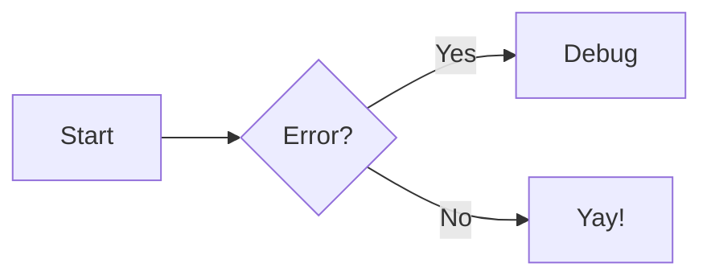

# Authoring content

Zensical content is **Python Markdown** plus Python Markdown Extensions. Two rules underlie almost
everything here:

1. **Indent nested content by 4 spaces** (or a tab) — admonition bodies, content-tab bodies,
   multi-paragraph list items, multi-line footnotes. Two spaces silently fails.
2. **A feature renders only if its Markdown extension is enabled** in `zensical.toml`
   (`[project.markdown_extensions.*]`). Each section lists what it needs; full option detail and the
   `zensical new` default set are in `extensions.md` / `configuration.md`.

## Page basics

- **Write a `# H1`** in the body. Title priority: `nav` title → front matter `title` → first `# H1` →
  file base name. (No separate required title field; the H1 is expected.)
- **Link to `.md` files with relative paths** — `[Setup](../setup/basics.md)`, not `.html`, not
  absolute. Zensical rewrites them for the current `use_directory_urls`; build-time validation flags
  broken links (see `setup.md`).
- `README.md` → `index.html` (like MkDocs). Don't keep both `README.md` and `index.md` in one folder.

## Front matter

```yaml
---
title: Lorem ipsum            # overrides nav + <title>
description: Short summary.    # <meta> description
icon: lucide/braces           # nav icon
status: new                   # status badge (map ids in [project.extra.status])
tags: [HTML5, CSS]            # page tags (see setup.md)
template: home.html           # custom template from the overrides dir
hide: [navigation, toc, path, tags]   # hide page chrome
render_macros: true           # Macros extension, per-page (see extensions.md)
---

# Page title
```

Extra keys are available in templates as `page.meta.<key>`.

## Admonitions

Needs: `admonition`, `pymdownx.details`, `pymdownx.superfences`.

```markdown
!!! note "Optional custom title"

    Body indented by 4 spaces. Use `!!! note ""` for no title.
```

- Types: `note`, `abstract`, `info`, `tip`, `success`, `question`, `warning`, `failure`, `danger`,
  `bug`, `example`, `quote` (default `note`).
- Collapsible: `??? note` (collapsed) / `???+ note` (expanded).
- Modifiers: `inline` / `inline end` for side-by-side. Nest by indenting.

## Content tabs

Needs: `pymdownx.superfences`, `pymdownx.tabbed` (`alternate_style = true`).

```markdown
=== "C"

    ```c
    printf("Hello world!\n");
    ```

=== "C++"

    ```cpp
    std::cout << "Hello world!";
    ```
```

Bodies indent 4 spaces; tabs nest anything. Site-wide linked tabs: add `"content.tabs.link"` to
`[project.theme].features`.

## Code blocks

Needs (recommended): `pymdownx.highlight` (`anchor_linenums`, `line_spans = "__span"`,
`pygments_lang_class = true`), `pymdownx.inlinehilite`, `pymdownx.snippets`, `pymdownx.superfences`.

````markdown
``` py title="bubble_sort.py" linenums="1" hl_lines="2 3"
def bubble_sort(items):
    ...
```
````

- `title="…"`, `linenums="<start>"`, `hl_lines="2 3"` / `"3-5"` (counts from 1).
- Per-block toggles (Attribute Lists): ` ``` { .py .copy } `, `.no-copy`, `.select`, `.no-select`,
  `.annotate`; language shortcode first, prefixed `.`. `.text` = no highlight.
- Inline: `` `#!python range()` ``. Embed a file: `--8<-- "path"` (Snippets).
- Global buttons (feature flags): `content.code.copy`, `content.code.select`,
  `content.code.annotate`.
- Annotations: `(1)` marker in a comment + a numbered list item after the block; `# (1)!` strips the
  comment chars.

## Buttons

Needs: `attr_list`.

```markdown
[Subscribe](#){ .md-button }
[Subscribe](#){ .md-button .md-button--primary }
[Send :fontawesome-solid-paper-plane:](#){ .md-button }
```

## Grids & cards

Needs: `attr_list`, `md_in_html`.

```html
<div class="grid cards" markdown>

-   :material-clock-fast:{ .lg .middle } __Set up in 5 minutes__

    ---

    Install `zensical` with `pip` and get running in minutes.

    [:octicons-arrow-right-24: Getting started](#)

</div>
```

- Generic grid: `<div class="grid" markdown>` wrapping arbitrary blocks (admonitions, code, tabs).
- Block-syntax card: append `{ .card }` to a block inside a `grid`.
- The wrapping `div` **must** carry `markdown` for inner Markdown to render.

## Diagrams (Mermaid)

Needs a `custom_fences` entry under `pymdownx.superfences`:

```toml
[project.markdown_extensions.pymdownx.superfences]
custom_fences = [
  { name = "mermaid", class = "mermaid", format = "pymdownx.superfences.fence_code_format" }
]
```

````markdown

````

Officially styled: flowchart, sequence, state, class, entity-relationship (work with instant nav +
both color schemes). pie/gantt/journey/gitgraph/requirement render but aren't officially supported.
Customize (e.g. ELK) via an `extra_javascript` `.mjs` that sets `window.mermaid`.

## Math

Needs `pymdownx.arithmatex` (`generic = true`) + a MathJax **or** KaTeX integration via
`extra_javascript`, wired with a `document$`-aware init so it re-renders under instant navigation (see
the Math section of `configuration.md` / the Arithmatex entry in `extensions.md`).

```latex
$$ \cos x = \sum_{k=0}^{\infty} \frac{(-1)^k}{(2k)!} x^{2k} $$

Inline: $f$ is injective iff its kernel is $\{e_G\}$.
```

Block: `$$…$$` or `\[…\]` on their own lines. Inline: `$…$` or `\(…\)`.

## Data tables

Needs: `tables` (in the defaults). Standard pipe tables; cells take inline Markdown, code, and icons.

```markdown
| Method   | Description                          |
| :------- | :----------------------------------: |
| `GET`    | :lucide-check: Fetch resource        |
```

Column alignment via `:` on the divider row: `:---` left, `:---:` center, `---:` right. **Sortable
tables** aren't built in — add `tablesort` via `extra_javascript` with a `document$` subscriber
(instant-nav safe), targeting `article table:not([class])`.

## Formatting

Needs: `pymdownx.caret`, `pymdownx.mark`, `pymdownx.tilde`, `pymdownx.keys`.

```markdown
==marked / highlight==      ^^inserted / underline^^      ~~deleted / strikethrough~~
H~2~O      A^T^A                                          ++ctrl+alt+del++
```

## Icons & emojis

Needs: `attr_list`, `pymdownx.emoji` (with Zensical's `to_svg`/`twemoji` generators — see
`extensions.md`). 10,000+ icons, thousands of emojis.

- Emoji: `:smile:` (shortcodes at Emojipedia for Twemoji).
- Icon: a bundled icon path with `/`→`-`, e.g. `:fontawesome-regular-face-laugh-wink:`.
- Bundled sets: **Lucide** (`lucide/*`), **Material Design** (`material/*`), **FontAwesome**
  (`fontawesome/*`), **Octicons** (`octicons/*`), **Simple Icons** (`simple/*`).
- Color/animate via Attribute Lists + an `extra_css` class: `:fontawesome-brands-youtube:{ .youtube }`,
  `:octicons-heart-fill-24:{ .heart }` (define `.youtube`/`@keyframes heart` in CSS — avoid inline
  styles).
- In templates: `<span class="twemoji"></span>`.
- Add custom icon sets via the emoji `options.custom_icons` (see `setup.md` → Logo & icons).

## Images

Needs: `attr_list`, `md_in_html`, `pymdownx.blocks.caption`.

- **Align:** `{ align=left }` / `align=right` (no centered — use a caption instead).
- **Width:** `{ width="300" }`. **Lazy-load:** `{ loading=lazy }`.
- **Caption** (two ways):

  ```markdown
  { width="300" }
  /// caption
  Image caption
  ///
  ```

  or literal `<figure markdown="span"> … <figcaption>…</figcaption> </figure>`.
- **Light/dark:** append `#only-light` / `#only-dark` to the URL (custom color schemes need extra CSS
  selectors — see the page). Also `#gh-light-mode-only` / `#gh-dark-mode-only`.
- **Lightbox/zoom:** enable the GLightbox extension (see `extensions.md`).

## Lists

Needs (for definition + task lists): `def_list`, `pymdownx.tasklist` (`custom_checkbox = true`).
Unordered (`-`/`*`/`+`) and ordered (`1.`) are core. Nest by indenting **4 spaces**.

```markdown
`term`

:   Definition (indent 4 spaces).

- [x] done
- [ ] todo
    * [x] nested task
```

## Tooltips, abbreviations & glossary

Needs: `abbr`, `attr_list`, `pymdownx.snippets`. Enable nicer tooltips with the `content.tooltips`
feature flag.

- **Link tooltip:** `[Hover me](https://example.com "I'm a tooltip!")` (also works on reference links).
- **Any element:** `:material-information-outline:{ title="Important information" }`.
- **Abbreviations:** define with `*[HTML]: Hyper Text Markup Language`; matching terms get a tooltip.
- **Site-wide glossary:** put all `*[…]:` definitions in e.g. `includes/abbreviations.md` (outside
  `docs/`) and auto-append via `[project.markdown_extensions.pymdownx.snippets]`
  `auto_append = ["includes/abbreviations.md"]`.

## Footnotes

Needs: `footnotes`. Optional inline tooltips via the `content.footnote.tooltips` feature flag.

```markdown
Lorem ipsum[^1] dolor[^2].

[^1]: Short footnote on one line.
[^2]:
    Long footnote — paragraphs indented 4 spaces.
```

References render at the page bottom with an automatic backlink.

---

When a feature you need isn't in the project's `markdown_extensions`, add the extension table (and any
required option) before using it — otherwise it renders as plain text. Full option reference:
`extensions.md`.
